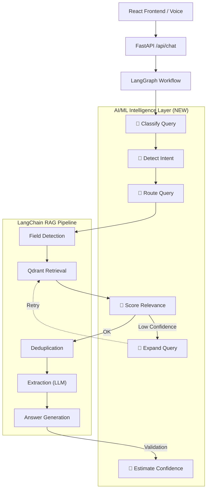

# RAG Assistant — Enterprise Multi-Modal AI Intelligence & Voice RAG Platform

An advanced, production-ready Retrieval-Augmented Generation (RAG) system with an embedded AI/ML Intelligence Layer. It is designed to handle complex multi-field retrieval, diverse document formats, and voice-based interactions while ensuring high accuracy and observability.

---

## 🎯 Problem Statement

**The Challenge:**
As organizations accumulate massive volumes of unstructured data across diverse formats (PDFs, Word documents, Spreadsheets, JSON, and Audio/Video transcripts), retrieving accurate, contextually relevant information becomes increasingly difficult. Existing RAG implementations face critical limitations:
1. **Query Ambiguity:** Standard vector searches fail when a user's intent requires structured data extraction, summarization, or cross-document aggregation rather than a simple semantic match.
2. **Data Silos & Format Diversity:** Organizations need to extract insights seamlessly across disparate file types without deploying disjointed, format-specific search tools.
3. **Hallucinations & Context Bleed:** Without strict document-level isolation, LLMs often hallucinate answers by conflating information from unrelated documents within the same vector space.

**The Solution:**
The **RAG Multi-Field Retrieval** platform addresses these challenges by introducing an intelligent, state-machine-driven orchestration layer (via LangGraph) above the vector database (Qdrant/ChromaDB). By combining deterministic workflow routing with semantic intelligence, this architecture guarantees highly accurate, source-grounded answers, significantly reducing hallucination rates and enabling users to safely query complex enterprise knowledge bases.

---

## 🌟 Key Features

- **AI/ML Intelligence Layer**: Zero-dependency (no heavy ML frameworks) query classification, intent detection, and relevance scoring powered by embeddings and deterministic logic.
- **LangGraph Orchestration**: A resilient, state-machine-driven RAG workflow supporting dynamic query expansion, conditional retries for missing fields, and parallel execution.
- **Observability & Tracing**: Fully integrated LangSmith tracing for step-by-step debugging, prompt evaluation, and RAG pipeline diagnostics.
- **Multi-Modal Retrieval**: Intelligently routes queries using targeted, field-level, or broad summary strategies based on user intent.
- **Extensive Document Processing**: Supports parsing, chunking, and embedding for PDF, DOCX, TXT, CSV, XLSX, JSON, and Video/Audio (via built-in STT/TTS).
- **Safe Fallbacks**: Guaranteed "Do No Harm" architecture that gracefully falls back to a deterministic RAG pipeline if the AI/ML layer encounters an issue.

---

## 🏗️ Architecture

The system is built on a modern, scalable tech stack:

- **Frontend**: React (Vite) providing a rich, interactive chat and document management interface.
- **Backend**: FastAPI (Python) serving robust async APIs for processing and chat.
- **Vector Database**: Configurable support for **Qdrant** (default) or **ChromaDB** for high-performance vector search.
- **Relational Database**: PostgreSQL (via Supabase) for tracking chat sessions, document metadata, and categories.
- **Embeddings**: `BAAI/bge-small-en-v1.5` (via FastEmbed) for fast, local embedding generation.
- **LLM Engine**: Configurable (defaults to local-grounded models).
- **Orchestration**: LangChain & LangGraph for complex tool use and conversational state.



---

## 🚀 Getting Started

### Prerequisites
- Docker and Docker Compose
- Supabase (PostgreSQL) Database URL
- (Optional) LangSmith API Key for tracing

### 1. Environment Setup

Clone the repository and navigate to the project directory.

In the `backend` folder, copy the example environment file:
```bash
cp backend/.env.example backend/.env
```

Update `backend/.env` with your actual Supabase database URL, your LangSmith API key (for tracing), and your preferred `VECTOR_STORE` (either `qdrant` or `chroma`).

### 2. Run the Application

The entire application is containerized for seamless deployment. Start it using Docker Compose from the root directory:

```bash
docker-compose up -d --build
```

### 3. Access the Services

Once the containers are running, you can access the different components:
- **Web App**: [http://localhost:3000](http://localhost:3000)
- **API Documentation**: [http://localhost:8000/docs](http://localhost:8000/docs)
- **Qdrant Dashboard**: [http://localhost:6333/dashboard](http://localhost:6333/dashboard)

---

## 📁 Project Structure

```
rag-multi-field-retrieval/
├── docker-compose.yml       # Multi-container deployment config
├── .gitignore
├── README.md
│
├── backend/
│   ├── .env                 # Environment configurations
│   ├── .env.example
│   ├── requirements.txt     # Python dependencies
│   ├── Dockerfile           # Backend container definition
│   ├── check_cats.py        # Database/Category check script
│   ├── check_db.py          # Database validation script
│   ├── get_doc.py           # DB document inspection script
│   ├── test_connections.py  # Supabase/Qdrant connection testing
│   ├── test_pipeline.py     # Pipeline validation
│   └── app/
│       ├── __init__.py
│       ├── main.py          # FastAPI application entry point
│       ├── database.py      # SQLAlchemy & Supabase connection
│       ├── models.py        # Database models (Documents, Sessions)
│       ├── schemas.py       # Pydantic API validation schemas
│       ├── api/             # API route handlers
│       │   ├── __init__.py
│       │   ├── categories.py# Category management API
│       │   ├── chat.py      # Chat and LLM interaction API
│       │   ├── debug.py     # Qdrant inspection tools
│       │   └── documents.py # Document upload and indexing API
│       └── rag/             # Core RAG logic & Architecture
│           ├── __init__.py
│           ├── chain.py            # LangChain LCEL implementation
│           ├── chunker.py          # Recursive text chunking
│           ├── cleaner.py          # Extracted text sanitization
│           ├── deduplicator.py     # Context compression and semantic deduplication
│           ├── embeddings.py       # FastEmbed embedding initialization
│           ├── graph_state.py      # LangGraph state typed dict
│           ├── graph_workflow.py   # LangGraph state machine orchestrator
│           ├── intelligence.py     # AI/ML intelligence layer (Intent, Routing)
│           ├── loader.py           # Multi-format document loading
│           ├── multi_field.py      # Structured field extraction logic
│           ├── prompts.py          # RAG system prompts
│           ├── retriever.py        # Dynamic hybrid/vector retriever
│           ├── vectorstore.py      # Factory abstraction for Qdrant and ChromaDB
│           └── video_processor.py  # Audio/Video STT (Whisper) processing
│
└── frontend/
    ├── package.json         # React dependencies
    ├── package-lock.json
    ├── Dockerfile           # Frontend container definition
    ├── index.html           # React root HTML
    ├── vite.config.js       # Vite build configuration
    └── src/                 
        ├── App.css          # Global styles
        ├── App.jsx          # Main React component / routing
        ├── main.jsx         # React DOM entry
        ├── services/        
        │   └── api.js       # Axios API client integrations
        └── components/      # React UI Components
            ├── CategoryGrid.jsx
            ├── CategoryManager.jsx
            ├── Chat.jsx
            ├── DocumentManager.jsx
            ├── DocumentSelectorModal.jsx
            ├── DocumentTree.jsx
            ├── Message.jsx
            ├── SidebarHierarchy.jsx
            ├── Source.jsx
            ├── TypeGrid.jsx
            └── Upload.jsx
```

---

## 📡 Key API Endpoints

The backend provides several RESTful endpoints. View the full interactive documentation at `/docs`.

- `POST /api/chat` - Submits a query to the LangGraph RAG pipeline.
- `POST /api/documents/upload` - Uploads, parses, chunks, and indexes a new document into Qdrant.
- `GET /api/documents` - Lists all processed documents and their status.
- `GET /api/categories` - Retrieves the document taxonomy hierarchy.

---

## 📊 Observability with LangSmith

To enable deep insights into how the RAG pipeline is performing, provide your LangSmith API key in `backend/.env`:

```env
LANGSMITH_TRACING=true
LANGSMITH_API_KEY=your-langsmith-api-key
LANGSMITH_PROJECT=RAG-Multi-Field-Retrieval
```

When enabled, all query classifications, intent detections, vector retrievals, LLM prompts, and final answers are automatically logged to your LangSmith dashboard under the specified project name. This is crucial for debugging complex multi-field extractions and monitoring prompt performance.
